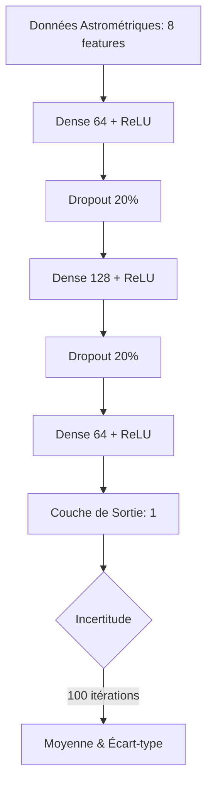

#  Gaia RV Predictor (MC Dropout)

Ce projet utilise l'apprentissage profond pour prédire la **vitesse radiale** des étoiles à partir des données astrométriques de la mission **Gaia DR3**. Il intègre une gestion de l'incertitude via la technique du **Monte Carlo Dropout**.

##  Architecture du Modèle

Le modèle est un réseau de neurones dense (MLP) où le Dropout est maintenu actif lors de l'inférence pour générer une distribution de prédictions.

# Fonctionnalités
Collecte ADQL : Requête automatisée sur les serveurs de l'ESA (Gaia Archive).

Feature Engineering : Calcul de la distance (parsec), magnitude absolue et vitesse tangentielle.

Quantification d'Incertitude : Estimation de la fiabilité de chaque prédiction.

# Visualisation
Le script génère des graphiques comparant les valeurs réelles de Gaia avec les prédictions de l'IA, accompagnées de leurs barres d'erreur (incertitude épistémique).
